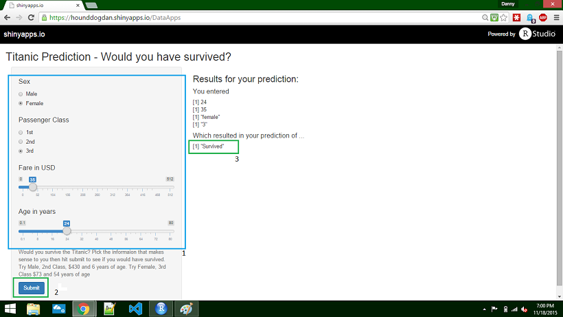
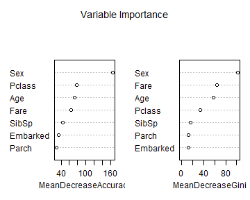

## The Titanic Prediciton Shiny App

My shiny app's purpose is to allow you to explore a `predictive model` bulit from the Titanic data set. 

 When reviewing the model, try to answer these questions:

- Can you tell where the decision trees split? 
- Can you tell which variables have the greatest importance?


For fun, enter your own information to see if you would survive. 

GitHub Repository http://HoundDogDan.github.io/TitanicSlides

ShinyApp https://hounddogdan.shinyapps.io/DataApps

--- .class #id 
## How to use the App
1. Choose and set values 
2. Click the Submit button
3. Review the prediction



--- .class #id 
## Why the App works

The prediction model was built on the Titantic dataset using basic features and a random forrest algorithm. The outcome of the intense calculations are then saved in an R data set. This is done outside of the ShinyApp.  The ShinyApp loads the saved predicted model. The prediction algorithm is run against that copy of the model.

The input data from step one is collected and transormed upon submission to a data.frame and then predicted against the model.

The Shiny App performs better this way because the randomForrest algorithm can take a long time (and many resources) to build in real time. 


--- .class #id 
## Answers
Here is the graph depicting the importance of variables:

```r
modrf <- readRDS("E:/DataApps/data/modrf_titanic5.rds")
varImpPlot(modrf, main="Variable Importance")
```

 

